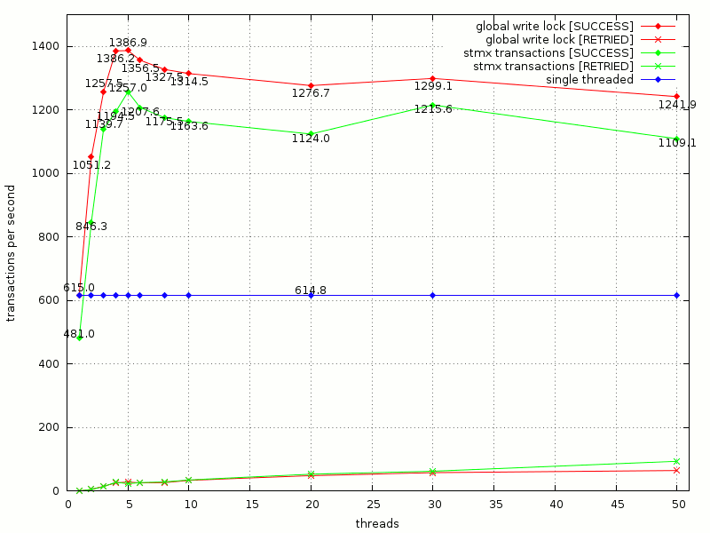
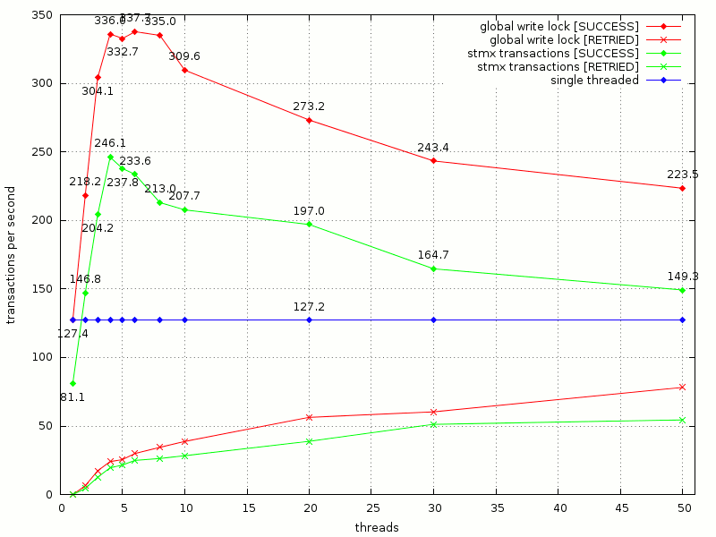

Lee-STMX
========

Lee-STMX is a benchmark for [STMX](https://github.com/cosmos72/stmx), a high-performance software
transactional memory library for Common Lisp.

STMX is available from [GitHub](https://github.com/cosmos72/stmx),
more information about it can be found in its
[README](https://github.com/cosmos72/stmx/blob/master/README.md).

A general introduction on software transactional memory is available
in many places, including at least [Wikipedia](http://en.wikipedia.org/wiki/Software_transactional_memory)
and several research papers. One of the most introductory, but still
quite technical is [Composable Memory Transaction](http://research.microsoft.com/%7Esimonpj/papers/stm/stm.pdf)
from Microsoft research.

Lee-STMX is a porting of [Lee-TM](http://apt.cs.man.ac.uk/projects/TM/LeeBenchmark/)
to STMX. It is a non-trivial benchmark suite for transactional memory
developed in 2007 by the University of Manchester (UK), then ported to
STMX by the STMX author.

Status
------

As of May 2013, Lee-STMX is being written by Massimiliano Ghilardi
and it is considered BETA quality by the author.

At the same date, STMX is considered to be stable.

Benchmark results
-----------------

What follows are some timings obtained on the authors's system, and by no means they
claim to be exact, absolute or reproducible: your mileage may vary.

Date: 08 June 2013

Hardware: Intel Core-i5 750 @4.0 GHz (quad-core), 16GB RAM

Software: Debian GNU/Linux 7.0 (x86_64), SBCL 1.1.7 (x86_64), STMX 1.3.2

Results for MEMBOARD circuit:

Results for MAINBOARD circuit:

Legal
-----

Lee-STMX is released under the terms of the
[BSD](http://opensource.org/licenses/BSD-3-Clause) license.

STMX is released under the terms of the [Lisp Lesser General Public
License](http://opensource.franz.com/preamble.html), known as the LLGPL.
