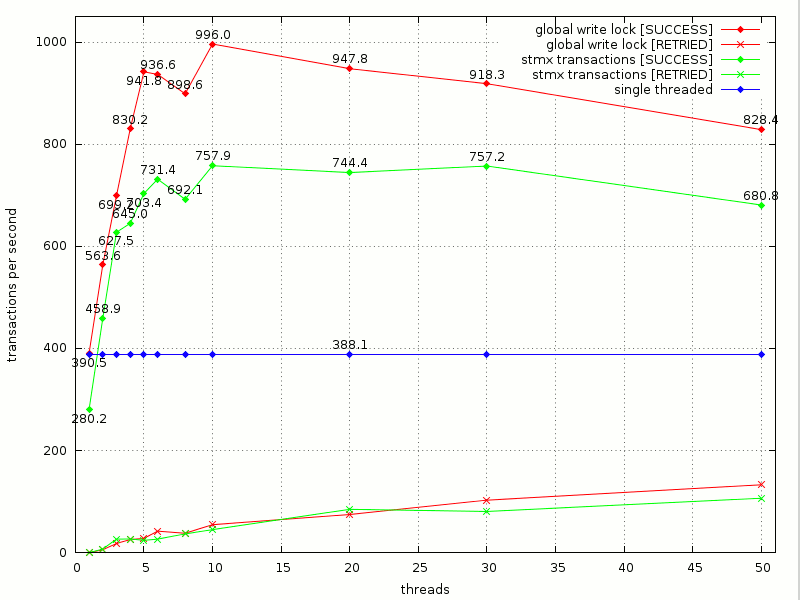

Lee-STMX
========

Lee-STMX is a benchmark for [STMX](https://github.com/cosmos72/stmx), a high-performance software
transactional memory library for Common Lisp.

STMX is available from [GitHub](https://github.com/cosmos72/stmx),
more information about it can be found in its
[README](https://github.com/cosmos72/stmx/blob/master/README.md).

A general introduction on software transactional memory is available
in many places, including at least [Wikipedia](http://en.wikipedia.org/wiki/Software_transactional_memory)
and several research papers. One of the most introductory, but still
quite technical is [Composable Memory Transaction](http://research.microsoft.com/%7Esimonpj/papers/stm/stm.pdf)
from Microsoft research.

Lee-STMX is a porting of [Lee-TM](http://apt.cs.man.ac.uk/projects/TM/LeeBenchmark/)
to STMX. It is a non-trivial benchmark suite for transactional memory
developed in 2007 by the University of Manchester (UK), then ported to
STMX by the STMX author. It aims at implementing a realistic workload, with longer transactions than what found in common "artificial" micro-benchmarks.

Status
------

As of May 2013, Lee-STMX is being written by Massimiliano Ghilardi
and it is considered BETA quality by the author.

At the same date, STMX is considered to be stable.

Benchmark results
-----------------

What follows are some timings obtained on the authors's system, and by no means they
claim to be exact, absolute or reproducible: your mileage may vary.

Date: 08 June 2013

Hardware: Intel Core-i5 750 @4.0 GHz (quad-core), 16GB RAM

Software: Debian GNU/Linux 7.0 (x86_64), SBCL 1.1.7 (x86_64), STMX 1.3.2

Results for MEMBOARD benchmark:

Results for MAINBOARD benchmark:

Analysis and comments
---------------------

- First, it is evident that in Lee-STMX benchmark, using STMX transactions is always faster than single-threaded code as soon as STMX runs at least two threads. Since STMX targets multi-threaded code, this is good news.

With 4 threads on a quad-core machine, STMX delivers a 70-90% performance improvement with respect to single-threaded code on this benchmark (the peak performance ratio is 246.1 / 127.2 = 1.93 = 193%). Good, but still very far from the theorical maximum of 300% improvement, i.e. quadruple speed.

- Second, on this benchmark STMX transactions are typically 25-35% slower than highly optimized locking code: by assuming 100% as locking code performance, STMX reaches 65-75% of it for any number of threads.
This is hardly new, as **many** research papers discuss and analyze the overhead imposed by software transactional memory, looking for optimizations to reduce such overhead.

In this case, the optimized locking code running 4 threads on a quad-code machine delivers a 125-165% performance improvement with respect to single-threaded code (the peak performance ratio is 797.8 / 354.6 = 2.65 = 265%). Significantly better than transactions, but still far from quadruple speed.

- Finally, a deeper analysis of this benchmark reveals that more than 99.5% of the time is spent in the function `EXPAND-FROM`, which reads memory shared among the threads (in the STMX version of the benchmark, it is transactional memory) but never writes into it. Only `BACKTRACK-FROM`, which accounts for less than 0.5% of the execution time, actually writes into memory shared among the threads (in the STMX version of the benchmark, `BACKTRACK-FROM` is an atomic transaction).

This means that Lee-STMX benchmark, as well as the original Lee-TM benchmark, is almost read-only: writes to shared/transactional memory are very few and grouped together, and it spends large amounts of time without writing at all to shared/transactional memory. For this reason the performance results are probably somewhat biased in favor of STMX, since most of the time is actualy spent outside transactions. On the other hand, also the optimized locking code takes advantage heavily of this imbalance, to the point of being implemented with unlocked reads and a global write lock (plus some tricks borrowed by transactions to handle inconsistent reads).

Summary
-------

Lee-STMX is a benchmark for software transactional memory aiming at implementing a realistic workload. STMX shows quite good performance on it: 70-90% better than single-threaded code on a quad-core machine, yet behind highly optimized locking code, which shows 125-165% better performance than single-threaded code.

Quite unfortunately, Lee-STMX was found to have a strongly imbalanced workload: it contains a high number of transactioanl memory reads (actually executed outside transactions), but very few and grouped transactional memory writes.

Since there are no obviously tunable parameters to change the ratio of reads and writes, nor to change the ratio of time spent inside and outside transactions, STMX author recommends further benchmarking to validate STMX performance on workloads with more transactional writes and more time spent inside transactions.

Legal
-----

Lee-STMX is released under the terms of the
[BSD](http://opensource.org/licenses/BSD-3-Clause) license.

STMX is released under the terms of the [Lisp Lesser General Public
License](http://opensource.franz.com/preamble.html), known as the LLGPL.
